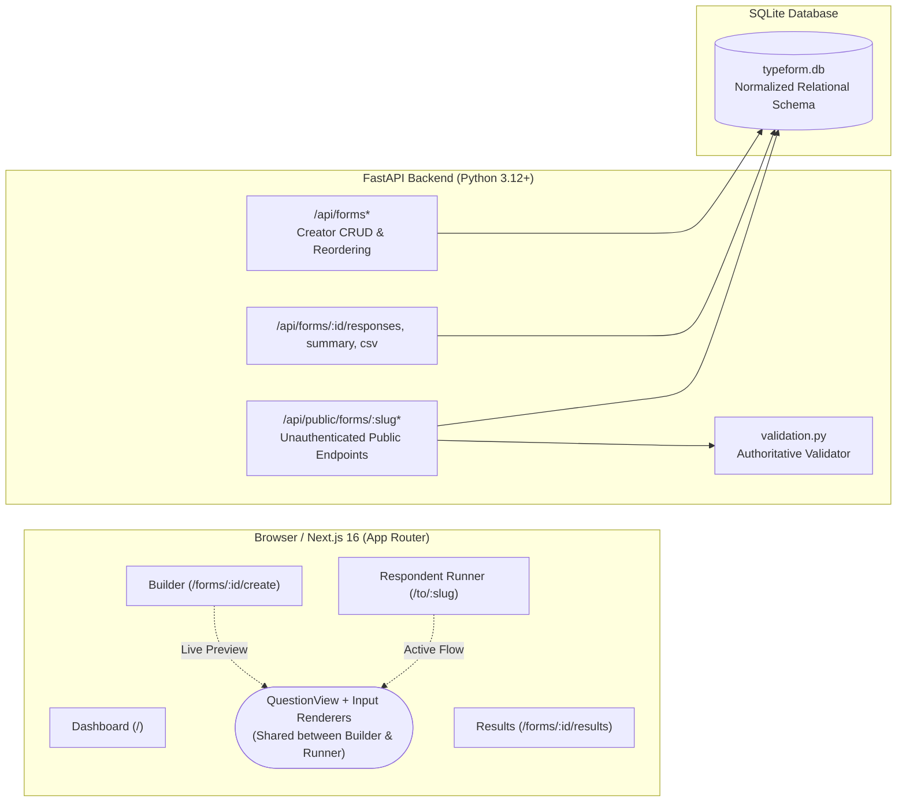
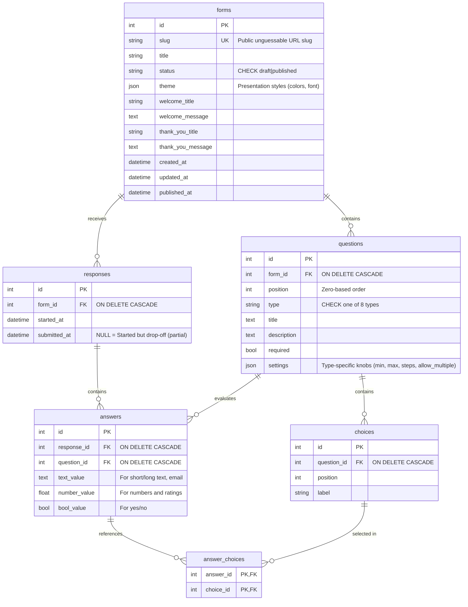

# formly — Fullstack Typeform Clone
> **SDE Fullstack Assignment Submission**  
> An end-to-end recreation of Typeform’s form builder and conversational respondent experience.

- **Live Application:** [https://typeform-clone-navy.vercel.app](https://typeform-clone-navy.vercel.app)
- **API & Swagger Docs:** [https://typeform-clone-api-qshm.onrender.com/docs](https://typeform-clone-api-qshm.onrender.com/docs)
- **GitHub Repository:** [https://github.com/anupriya1810/typeform-clone](https://github.com/anupriya1810/typeform-clone)
- **Tech Stack:** Next.js 16 (App Router, TypeScript, Tailwind CSS v4) · FastAPI (Python 3.12+) · SQLAlchemy 2 · SQLite

---

## Table of Contents
1. [Project Overview](#project-overview)
2. [Key Features](#key-features)
3. [System Architecture](#system-architecture)
4. [Database Design & Schema](#database-design--schema)
5. [API Specification](#api-specification)
6. [Key Engineering Decisions & Trade-offs](#key-engineering-decisions--trade-offs)
7. [Running Locally](#running-locally)
8. [Testing & Verification](#testing--verification)
9. [Deployment Overview](#deployment-overview)
10. [Assumptions & Future Roadmap](#assumptions--future-roadmap)

---

## Project Overview

In this project, I set out to build a production-grade clone of Typeform that replicates both sides of the product:
1. **The Creator Studio:** A clean, three-pane drag-and-drop form builder with live responsive preview, inline canvas editing, custom themes, and an analytics dashboard.
2. **The Respondent Flow:** Typeform’s signature conversational, one-question-at-a-time form player with direction-aware slide/fade transitions, comprehensive keyboard shortcuts, and dual-layer validation.

The project is structured as a monorepo with clean separation of concerns: a Next.js TypeScript frontend deployed on Vercel and a FastAPI backend with SQLite deployed on Render.

---

## Key Features

### 1. Form Builder (`/forms/:id/create`)
- **Three-Pane Studio:** Left navigation tree for question hierarchy, center canvas for real-time WYSIWYG editing, and right panel for contextual question/theme properties.
- **8 Question Types:** Short Text, Long Text, Multiple Choice (single or multi-select), Dropdown, Email, Number (with min/max constraints), Yes/No, and Star Rating (configurable 3–10 stars).
- **Direct Canvas Editing:** Click directly on question titles, descriptions, and choices on the canvas to edit them inline.
- **Accessible Drag-and-Drop:** Built using `@dnd-kit` with keyboard, mouse, and touch support for reordering questions.
- **Custom Themes & Dark Mode:** 6 curated color presets (*Classic, Midnight dark mode, Coral, Forest, Sunset, Slate*), custom HEX color pickers (Background, Question, Answer), and Google Fonts selection (*Inter, Roboto, Playfair Display, Space Mono*).
- **Responsive Canvas Modes:** Instant toggle between Desktop and Mobile preview widths, plus a full-screen **Preview** modal that runs the real respondent flow without publishing.
- **Debounced Autosave:** Changes persist automatically after a 700ms debounce with visual "Saving… / Saved" feedback and a write-queue to prevent race conditions.

### 2. Form Management & CRUD (`/`)
- **Workspace Dashboard:** Shows all draft and published forms with live metrics (total submissions, question counts, and relative updated timestamps).
- **Full Form Lifecycle:** Create new forms, rename, duplicate (deep copies all questions and choices into a fresh draft), and delete (with safety confirmation dialog).
- **Publishing Safeguards:** Generates an unguessable 48-bit URL slug (`/to/:slug`). Empty forms cannot be published (enforced by the backend with HTTP 422).

### 3. Respondent Experience (`/to/:slug`)
- **Conversational Full-Screen Flow:** Pure one-question-at-a-time presentation with zero page reloads.
- **Direction-Aware Transitions:** Smooth CSS keyframe slide/fade animations that adapt direction (sliding up on forward progress, down on backward navigation).
- **Full Keyboard Controls:**
  - `Enter`: Advance / Confirm answer
  - `Shift + Enter`: Insert newline in multi-line text areas
  - `A`–`Z`: Instant selection for multiple choice and dropdown options
  - `Y` / `N`: Toggle Yes/No questions
  - `1`–`9`: Rate with corresponding number of stars
  - `↑` / `↓`: Seamlessly navigate forward and backward between questions
- **Auto-Advance:** Single-choice selections trigger a quick highlight animation and automatically advance to the next step.
- **Progress Tracking:** Real-time percentage progress bar.
- **Authoritative Validation:** Immediate client-side validation for instant feedback, backed by strict server-side validation. If invalid answers are submitted, the runner automatically jumps back to the first failing question.

### 4. Results & Analytics (`/forms/:id/results`)
- **Top-Level Metrics:** Total Form Starts, Completed Submissions, and calculated **Completion Rate %**.
- **Summary View:** Visual distribution bars for multiple-choice and dropdown options, star distribution charts with computed rating averages, numeric min/max/average stats, and recent text response feeds.
- **Responses Table:** Tabular view of all submissions with timestamps. Clicking any row opens an inspect drawer displaying full respondent answers with the ability to delete individual entries.
- **Streaming CSV Export:** Generates and streams a downloadable `.csv` file with dynamic question headers.

---

## System Architecture



### Shared Renderer Architecture
Rather than building separate components for the builder's canvas preview and the respondent runner, I designed a single shared component tree (`QuestionView` + type-specific input components). 
- In **Builder Mode** (`live=false`), input labels are content-editable fields for immediate inline editing.
- In **Respondent Mode** (`live=true`), inputs accept keyboard shortcuts, manage user answers, and trigger validation.
This single-source design ensures the live preview can never drift from what respondents see.

---

## Database Design & Schema

I intentionally chose a **normalized relational schema** with typed columns over a generic JSON document blob.



### Rationale Behind Key Schema Choices:
1. **Typed Value Columns vs. Raw JSON Blob:**
   - Storing answers as `text_value`, `number_value`, and `bool_value` enables efficient SQL aggregation (`AVG(number_value)`, `MIN`, `MAX`, `GROUP BY`) directly in the database without loading thousands of records into Python memory.
   - It guarantees database-level type integrity (preventing a number question from storing corrupted string data).
2. **Relational Choices Table with Stable IDs:**
   - Multiple choice options are individual rows rather than a string array. Answers reference `choice_id`. This means if a creator renames "Choice A" to "Enterprise Plan", all historical answers and aggregate metrics remain linked accurately.
3. **Partial Response Tracking via `submitted_at IS NULL`:**
   - When a respondent opens a form, `/start` creates a `responses` row with `submitted_at = NULL`.
   - When submitted, the row is finalized with `submitted_at = now()`.
   - This makes calculating the completion rate a clean SQL expression: `COUNT(submitted_at) / COUNT(*)`.
4. **SQLite PRAGMA foreign_keys:**
   - SQLite ignores foreign keys by default. I configured the engine connection listener to enforce `PRAGMA foreign_keys=ON`, ensuring `ON DELETE CASCADE` reliably purges orphaned questions, choices, and answers.
5. **UTC Timezone Normalization:**
   - SQLite lacks timezone-aware datetime storage. I implemented a custom `UTCDateTime` TypeDecorator in SQLAlchemy to ensure all timestamps are persisted in UTC and serialized with explicit `+00:00` offsets to prevent client timezone drift.

---

## API Specification

All endpoints are prefixed with `/api`. The backend automatically generates interactive Swagger documentation at **`/docs`**.

### Creator Endpoints (Workspace & Studio)
| Method | Path | Description |
|---|---|---|
| `GET` | `/api/forms` | Lists all forms with SQL subquery-computed response and question counts |
| `POST` | `/api/forms` | Creates a new form draft with default title |
| `GET` | `/api/forms/{id}` | Fetches full form structure with questions and choices loaded via `selectinload` |
| `PATCH` | `/api/forms/{id}` | Partially updates form title, theme settings, or welcome/thank-you screens |
| `DELETE` | `/api/forms/{id}` | Cascading deletion of form and all associated responses |
| `PUT` | `/api/forms/{id}/questions` | **Replaces the complete ordered question list in a single atomic transaction** |
| `POST` | `/api/forms/{id}/duplicate` | Deep copies form, questions, and choices into a new draft |
| `POST` | `/api/forms/{id}/publish` | Publishes form (validates that at least one question exists) |
| `POST` | `/api/forms/{id}/unpublish` | Reverts form to draft status (immediately disables public link) |
| `GET` | `/api/forms/{id}/responses` | Returns all submitted responses (newest first) |
| `GET` | `/api/forms/{id}/responses/{rid}` | Returns individual submission detail with human-readable answer values |
| `DELETE` | `/api/forms/{id}/responses/{rid}` | Deletes a specific submission |
| `GET` | `/api/forms/{id}/summary` | Returns start/complete metrics, completion rate, and per-question analytics |
| `GET` | `/api/forms/{id}/responses.csv` | Streams response data as a downloadable CSV |

### Public Endpoints (Unauthenticated Respondents)
| Method | Path | Description |
|---|---|---|
| `GET` | `/api/public/forms/{slug}` | Fetches public form definition (returns 404 if draft or unknown) |
| `POST` | `/api/public/forms/{slug}/start` | Records that a user opened the form (returns `{ response_id }` for drop-off tracking) |
| `POST` | `/api/public/forms/{slug}/responses` | Validates and submits respondent answers against question rules |

---

## Key Engineering Decisions & Trade-offs

1. **Why FastAPI over Django:**  
   The backend is a focused RESTful JSON service. FastAPI with Pydantic delivers strict request validation, high asynchronous throughput, and automatic OpenAPI documentation with minimal boilerplate compared to Django's heavy ORM/admin stack.

2. **Atomic `PUT /questions` List Replacement:**  
   Rather than exposing individual `POST`, `PATCH`, and `DELETE` endpoints for every question and choice (which leads to race conditions, partial failure states, and complex drag-and-drop syncing), the builder saves the entire question array in one atomic transaction:
   - Existing questions with an `id` are updated in place (preserving answer links).
   - Questions without an `id` are inserted.
   - Questions omitted from the payload are deleted via `delete-orphan` cascades.

3. **Dual-Layer Validation Architecture:**  
   Typeform provides immediate feedback when hitting Enter. To match this, client-side validation (`validate.ts`) runs as the respondent progresses. However, clients can be bypassed; the backend authoritative validator (`validation.py`) verifies all constraints (email regex, number min/max, rating bounds, required states, and foreign choice ownership) upon submission and returns structured 422 errors mapped by question ID.

4. **Zero-Runtime CSS Variables for Theming:**  
   Instead of using heavy CSS-in-JS libraries, dynamic theme colors are injected as scoped CSS variables (`--tf-bg`, `--tf-q`, `--tf-a`) combined with modern CSS `color-mix()` for translucent button states. This guarantees zero runtime styling overhead.

---

## Running Locally

### Prerequisites
- **Python** ≥ 3.12
- **Node.js** ≥ 20
- **pnpm** (or npm)

### 1. Backend Setup
```bash
cd backend

# Create and activate virtual environment
python -m venv .venv
# On Windows:
.\.venv\Scripts\activate
# On macOS/Linux:
# source .venv/bin/activate

# Install dependencies
pip install -r requirements-dev.txt

# Start FastAPI development server
uvicorn app.main:app --reload --port 8000
```
- API will run at: `http://localhost:8000`
- Swagger documentation: `http://localhost:8000/docs`
- *Note:* On first boot, the backend automatically initializes `typeform.db` and **seeds two realistic published forms** (*Customer Feedback Survey* and *Tech Meetup Registration*) with 27 pre-filled responses.

### 2. Frontend Setup
```bash
cd frontend

# Install dependencies
pnpm install

# Start Next.js development server
pnpm dev
```
- Web Application will run at: `http://localhost:3000`
- Open `http://localhost:3000/to/feedback` to experience the respondent flow with full keyboard navigation.

### Environment Configuration
| Variable | Service | Default | Purpose |
|---|---|---|---|
| `DATABASE_URL` | Backend | `sqlite:///./typeform.db` | SQLAlchemy connection string |
| `CORS_ORIGINS` | Backend | `http://localhost:3000` | Comma-separated allowed CORS origins |
| `NEXT_PUBLIC_API_URL` | Frontend | `http://localhost:8000` | Base URL of the backend API |

---

## Testing & Verification

### Automated Test Suite
The repository includes an end-to-end integration test suite verifying the complete form lifecycle:
```bash
# Run backend test suite
cd backend
python -m pytest tests -v

# Run validation logic self-check
python -m app.validation

# Run frontend typecheck and production build
cd ../frontend
npx tsc --noEmit
pnpm build
```

`tests/test_api.py` executes against an isolated in-memory test database and validates:
1. Seed form loading and initial completion metric calculations.
2. Form creation and rejection of empty form publishing (HTTP 422).
3. Question batch creation, reordering, choice renaming, and stable ID preservation.
4. Public slug access control and unpublish 404 behavior.
5. Server validation edge cases (invalid email formats, out-of-range ratings).
6. Submission persistence, SQL summary calculations, and response CSV exports.
7. Form duplication and cascading deletion.

---

## Deployment Overview

The project is deployed across two modern cloud platforms:

1. **Frontend (Vercel):**  
   - Hosted at: [https://typeform-clone-navy.vercel.app](https://typeform-clone-navy.vercel.app)
   - Built directly from the `/frontend` root with Turbopack optimization.
   - Connected to the backend via `NEXT_PUBLIC_API_URL`.

2. **Backend (Render):**  
   - Hosted at: [https://typeform-clone-api-qshm.onrender.com](https://typeform-clone-api-qshm.onrender.com)
   - Runs as a Python Web Service with Uvicorn.
   - Configured with CORS regex matching `https://.*\.vercel\.app` to allow seamless preview and production communication.

---

## Assumptions & Future Roadmap

### Intentional Assumptions (per assignment spec):
- **Single Creator Workspace:** As permitted by the assignment guidelines, authentication is simplified to a default logged-in creator. Adding multi-tenancy simply requires an `owner_id` foreign key on the `forms` table and JWT auth middleware.
- **Anonymous Respondent Submissions:** Forms can be filled out by anyone with the public link without authentication.

### Future Roadmap:
1. **Conditional Logic Jumps:** Adding a `logic_rules` table (`question_id`, `operator`, `value`, `target_question_id`) with dynamic index branching in `FormRunner.tsx`.
2. **File Upload Question Type:** Direct multipart upload to S3/Cloudinary storage.
3. **Soft Deletion (`deleted_at`):** Retaining deleted questions in exports for historical integrity.
4. **PostgreSQL Migration:** Transitioning from SQLite to PostgreSQL by updating the `DATABASE_URL` connection string in SQLAlchemy.
