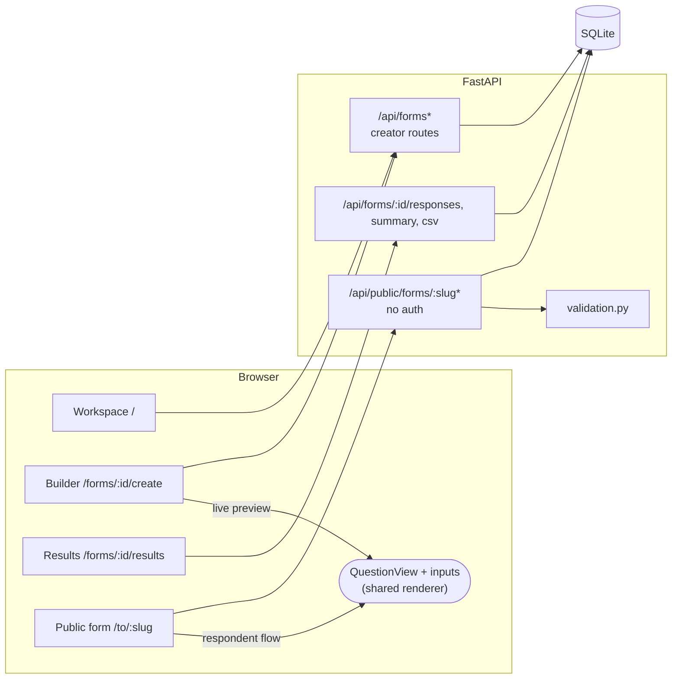
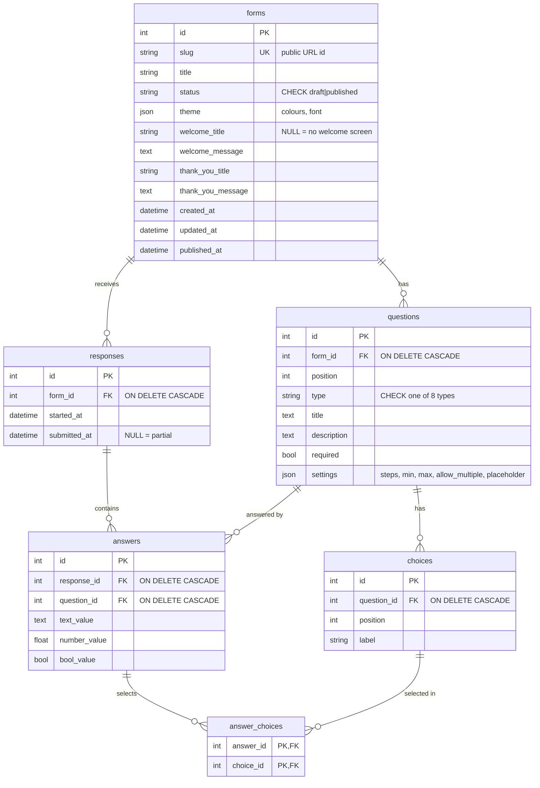

# formly — a Typeform clone

A form builder modelled on Typeform. Creators build forms in a three-pane builder with drag-and-drop and a live preview, publish them to a public link, and see the results. Respondents get Typeform's one-question-at-a-time flow with animated transitions and keyboard controls.

- **Live app:** _TBD (Vercel)_
- **API:** _TBD (Render)_ — interactive docs at `/docs`
- **Stack:** Next.js 16 (App Router, TypeScript, Tailwind v4) · FastAPI · SQLAlchemy 2 · SQLite

---

## Contents

1. [Features](#features)
2. [Running locally](#running-locally)
3. [Architecture](#architecture)
4. [Database schema](#database-schema)
5. [API overview](#api-overview)
6. [Design decisions (and why)](#design-decisions-and-why)
7. [Assumptions](#assumptions)
8. [Mocked / placeholder features](#mocked--placeholder-features)
9. [Testing](#testing)
10. [Deployment](#deployment)
11. [Known limitations and next steps](#known-limitations-and-next-steps)

---

## Features

**Form builder** (`/forms/:id/create`)
- Three panes like Typeform: the question list on the left, a live preview canvas in the middle, and question/design settings on the right.
- Eight question types: short text, long text, multiple choice (single or multi-select), dropdown, email, number (min/max), yes/no, and rating (3–10 stars).
- Add questions from a type picker, edit titles, descriptions and choices directly on the canvas, drag to reorder (mouse, touch or keyboard), duplicate and delete.
- Per-question settings: required, description, placeholder, and type-specific options.
- Editable welcome screen and thank-you screen.
- Themes: six presets plus custom colours and font. Preview at desktop or mobile width, and a full-screen **Preview** that runs the real respondent flow.
- Autosave with a "Saving… / Saved" indicator.

**Form management** (`/`)
- A list of forms showing status (Live/Draft), response count, question count and last update.
- Create, rename, duplicate, delete (with a confirmation modal), publish/unpublish and copy link.

**Respondent flow** (`/to/:slug`, no login)
- One question at a time, full screen, with a direction-aware slide/fade transition and a progress bar.
- Keyboard controls: `Enter` = OK, `Shift+Enter` = new line, `A–Z` picks a choice, `Y`/`N` answers yes/no, `1–9` sets a rating, `↑`/`↓` move between questions. Single-choice questions advance automatically after a short highlight.
- Validation runs in the browser as you go and again on the server when you submit (required, email format, number range, rating bounds, valid choice ids).
- Welcome screen, then the questions, then the thank-you screen.

**Results** (`/forms/:id/results`)
- Totals: responses, starts and completion rate.
- A **Summary** tab per question: choice counts with bars, rating distribution, average/min/max for numbers, and the latest text answers.
- A **Responses** tab with a table of submissions. Clicking a row opens a side drawer with the full response, which can also be deleted there.
- **CSV export.**

**Bonus items done:** custom themes (colours and font), CSV export, partial-response tracking with completion rate, and a dark theme for forms ("Midnight").

---

## Running locally

Requires Python ≥ 3.12, Node ≥ 20 and pnpm.

```bash
# 1. API  → http://localhost:8000  (docs at /docs)
cd backend
python -m venv .venv && source .venv/bin/activate
pip install -r requirements-dev.txt
uvicorn app.main:app --reload --port 8000

# 2. Web  → http://localhost:3000
cd frontend
cp .env.example .env.local        # NEXT_PUBLIC_API_URL=http://localhost:8000
pnpm install
pnpm dev
```

On first start the API creates `backend/typeform.db` and **seeds** it with two published forms (with 16 and 11 submitted responses plus some partial ones) and one draft. To start fresh, delete the `.db` file and restart.

| Env var | Where | Default |
|---|---|---|
| `DATABASE_URL` | backend | `sqlite:///./typeform.db` |
| `CORS_ORIGINS` | backend | `http://localhost:3000` (comma-separated) |
| `NEXT_PUBLIC_API_URL` | frontend | `http://localhost:8000` |

Try it: open `http://localhost:3000/to/feedback` and answer the questions using only the keyboard.

---

## Architecture



```
backend/
  app/
    main.py          app, CORS, router wiring, create tables + seed on first boot
    db.py            engine, FK pragma, session dependency
    models.py        SQLAlchemy models (the schema below)
    schemas.py       Pydantic request/response models (the API contract)
    validation.py    answer validation — authoritative
    answers.py       loose API "value" <-> typed answer columns
    seed.py          demo data
    routers/
      forms.py       creator CRUD, publish, save questions, duplicate
      results.py     responses, summary stats, CSV
      public.py      fetch published form, start, submit
  tests/test_api.py  end-to-end API test

frontend/
  app/
    page.tsx                     workspace (forms list)
    forms/[id]/layout.tsx        header + tabs; loads the form once into FormContext
    forms/[id]/create/page.tsx   builder
    forms/[id]/results/page.tsx  results
    forms/[id]/share|workflow|connect
    to/[slug]/page.tsx           public respondent page
  components/
    renderer/   FormRunner (flow, keys, transitions), QuestionView, inputs (one per type)
    builder/    QuestionList (dnd), Canvas, SettingsPanel, AddQuestionModal, useAutosave, FormContext
    ui/         Modal/Prompt/Confirm/Button, Menu/Toggle, Toast, StatusBadge, ComingSoon, Logo
  lib/
    api.ts            typed fetch client
    types.ts          mirrors backend schemas
    validate.ts       client copy of validation.py
    questionTypes.ts  per-type metadata (label, icon, colour, defaults)
```

---

## Database schema



Constraints and indexes:
- `UNIQUE(answers.response_id, answers.question_id)`: one answer per question per response.
- `UNIQUE(forms.slug)`.
- `CHECK` constraints on `forms.status` and `questions.type`.
- Indexes on `questions(form_id, position)`, `responses(form_id, submitted_at)`, `answers(question_id)`, `choices(question_id)` and `answer_choices(choice_id)`. These match the hot queries: load a form in order, count and list submitted responses, and aggregate per question or per choice.
- `PRAGMA foreign_keys=ON` is set on every connection, because without it SQLite ignores foreign keys and `ON DELETE CASCADE`.

---

## API overview

All routes are under `/api`. FastAPI publishes the full interactive spec at **`/docs`**.

### Creator (assumes the default logged-in creator)

| Method | Path | Purpose |
|---|---|---|
| GET | `/forms` | List forms with `response_count` and `question_count` (computed in SQL subqueries, no N+1) |
| POST | `/forms` | Create `{title}` |
| GET | `/forms/{id}` | Form with ordered questions and choices |
| PATCH | `/forms/{id}` | Partial update: title, theme, welcome or thank-you text |
| DELETE | `/forms/{id}` | Delete form, cascading to questions, responses and answers |
| PUT | `/forms/{id}/questions` | **Replace the ordered question list** in one transaction (see decisions) |
| POST | `/forms/{id}/duplicate` | Deep copy as a new draft |
| POST | `/forms/{id}/publish` · `/unpublish` | Toggle status (publishing requires at least one question) |
| GET | `/forms/{id}/responses` | Submitted responses, newest first |
| GET | `/forms/{id}/responses/{rid}` | One response |
| DELETE | `/forms/{id}/responses/{rid}` | Delete a response |
| GET | `/forms/{id}/summary` | Started, completed, completion rate and per-question aggregates |
| GET | `/forms/{id}/responses.csv` | CSV export |

### Public (no auth, published forms only, addressed by slug)

| Method | Path | Purpose |
|---|---|---|
| GET | `/public/forms/{slug}` | Fields a respondent needs (404 if draft or unknown) |
| POST | `/public/forms/{slug}/start` | Records an opened form → `{response_id}` (for completion rate) |
| POST | `/public/forms/{slug}/responses` | Submit `{response_id?, answers:[{question_id, value}]}` |

Answer `value` by type: text/email → `string`; number/rating → `number`; yes/no → `boolean`; multiple choice/dropdown → `number[]` of choice ids.

Validation failures return **422** with errors keyed by question id. The respondent UI jumps back to the first failing question:

```json
{ "detail": { "errors": { "12": "Please fill this in", "13": "Hmm... that email doesn't look right" } } }
```

---

## Design decisions (and why)

Each entry lists what I chose, why, what I rejected, and what the choice costs.

### Stack

**1. FastAPI rather than Django**
- **Why:** The backend is a small JSON API, so Django's admin, templates and auth would go unused. With FastAPI, Pydantic models are the API contract and validate requests automatically. It also generates OpenAPI docs at `/docs` for free, which makes the API easy to review.
- **Rejected:** Django + DRF. It works, but it needs serializers, viewsets and settings to produce the same thing.
- **Trade-off:** No built-in migrations or admin. Migrations are covered in decision 20.

**2. SQLAlchemy 2 ORM with typed `Mapped[...]` models**
- **Why:** The relationship cascades (`delete-orphan`) make "save the whole question list" easy to write correctly, and `selectinload` avoids N+1 queries when loading a form with its questions and choices. Aggregates are still written as explicit SQL expressions.
- **Rejected:** Raw `sqlite3` (too much hand-written mapping) and SQLModel (one more layer over the same SQLAlchemy).

**3. Next.js App Router with client-side data fetching**
- **Why:** Almost every screen is highly interactive (builder, runner, modals), and the data belongs to one creator, so server rendering gives nothing for SEO or speed here. Pages are client components that call the API with a small typed `fetch` wrapper (`lib/api.ts`).
- **Rejected:** Server Components plus Server Actions for mutations. That would split the data layer between Next.js and FastAPI, and the assignment requires the Python backend to own the data.
- **Trade-off:** The first paint shows a loading state. That is fine for a builder.

### Database

**4. Answers use typed columns (`text_value` / `number_value` / `bool_value`) plus an `answer_choices` join table, not one JSON blob per response**
- **Why:** The summary page needs averages, distributions and per-choice counts. With typed columns these are plain `GROUP BY` / `AVG` queries in SQL (see `routers/results.py`), and each value has a real type in the database. Multi-select and single-select are handled the same way, as rows in `answer_choices`.
- **Rejected:** `responses.data JSON`. It is easier to write, but every statistic would mean loading all responses into Python, and nothing would stop a number answer being stored as `"abc"`.
- **Trade-off:** Writing an answer means choosing the right column by question type. That logic lives in one small module, `answers.py`.

**5. Choices are rows with stable ids, not a JSON array on the question**
- **Why:** Answers point to `choice_id`, so renaming "Choice 1" to "Red" after responses have arrived updates every past answer and every count. With a JSON array of labels, a rename would orphan old answers, and two identical labels could not be told apart.
- **Trade-off:** One more table and join. Deleting a choice also removes it from past answers (cascade), which is the correct result: the option no longer exists.

**6. `questions.settings` and `forms.theme` are JSON**
- **Why:** These are per-type options (rating `steps`, number `min`/`max`, `allow_multiple`, `placeholder`) and presentation values. They are never filtered or joined on, and each question type has different keys. Separate columns would mostly be NULL, and a settings table per type would be over-engineering.
- **Where I drew the line:** Anything that is queried (type, required, position, status) is a real column with a constraint.

**7. Partial responses are rows with `submitted_at IS NULL`, not a separate table**
- **Why:** A response is a single record that is "started" and later "submitted". Completion rate is just `COUNT(submitted_at) / COUNT(*)`, and the submit call reuses the row created by `/start`. Everything that lists responses filters on `submitted_at IS NOT NULL`, which is what the `(form_id, submitted_at)` index is for.
- **Rejected:** A `visits` table. It would duplicate the same information.

**8. `position` integer for ordering**
- **Why:** The builder always saves the whole ordered list (decision 11), so positions are rewritten to `0..n-1` on every save. This is simple, and there are no gaps to manage.
- **Rejected:** Linked lists and fractional ranks. Those only help when you reorder single items without rewriting the list, which we never do.

**9. Deleting a question deletes its answers (cascade)**
- **Why:** An answer to a question that no longer exists cannot be shown in the table, summary or CSV. The builder warns about this in a confirmation modal before deleting.
- **Trade-off:** You cannot undo it. Real Typeform keeps deleted fields in exports; doing that would need soft-deletes (`deleted_at`). See [next steps](#known-limitations-and-next-steps).

**10. UTC everywhere, with a small `UTCDateTime` column type**
- **Why:** SQLite stores datetimes without a timezone. Without this type, the API returned naive timestamps and browsers read them as local time, so "Updated 5 hours ago" showed up in IST. The custom type stores UTC and puts the timezone back when reading, so the API always sends `+00:00`.

### API

**11. `PUT /forms/{id}/questions` replaces the whole ordered list in one transaction**
- **Why:** The builder's state is "an ordered list of questions". One idempotent PUT covers add, edit, reorder and delete:
  - questions with an `id` are updated in place, so existing answers stay linked;
  - questions without an `id` are created;
  - questions missing from the list are deleted.

  The response comes back in the same order as the request, so the client matches new ids to its rows by index.
- **Rejected:** Separate endpoints (`POST/PATCH/DELETE /questions/:id` plus `POST /reorder`). That means more endpoints, more partial-failure states, and a reorder that conflicts with a pending edit.
- **Trade-off:** The payload is the whole form. Forms have tens of questions, so this is a few KB.

**12. Public routes are separate (`/api/public/forms/{slug}`) and addressed by slug**
- **Why:**
  - Respondent and creator access are separated at the URL level. The public router only ever returns `PublicFormOut`, which has no timestamps or status.
  - Slugs are random and roughly 48-bit, so they cannot be enumerated the way `/forms/1`, `/forms/2` could.
  - A draft returns 404, so unpublishing takes effect immediately.
- The URL shape `/to/{slug}` copies Typeform's `form.typeform.com/to/{id}`.

**13. Validation happens on both sides, and the server decides**
- **Why:** Typeform shows errors the moment you press Enter, so the client validates (`lib/validate.ts`). Clients can't be trusted, so the server checks everything again (`app/validation.py`): types, required, email, ranges, rating bounds, and that choice ids belong to *this* question. The two files implement the same rules and say so in their headers. The server returns errors per question, and the runner takes the respondent back to the first broken one.
- **Rejected:** Sharing one schema between both sides (for example JSON Schema). With eight small rules, a shared schema layer would be more code than writing them twice.

**14. Publishing an empty form returns 422**
- **Why:** A live form with no questions is a broken link for respondents.

### Frontend

**15. One renderer for the live preview and the real form**
- **Why:** `QuestionView` and the input components are the same code in the builder canvas (`live=false`, labels editable inline) and on the public page (`live=true`). The preview therefore cannot drift from what respondents see, and every type is implemented once. The builder's **Preview** button runs the real `FormRunner`.
- **Rejected:** A separate "preview" component, which is twice the code and will drift.

**16. Autosave: debounced, run one at a time, and flushed before publish**
- **Why:** Typeform has no Save button. Edits change local state immediately, and after 700 ms of no typing they are persisted.
  - Saves are chained, never parallel. Two overlapping PUTs could each create the same new question.
  - The pending save is flushed when you leave the tab, before Preview, and before Publish (via a `flushRef` in `FormContext`).
  - Each row has a client-side `key`, so React and drag-and-drop have a stable identity before the server has assigned an id.
- **Trade-off:** If two browser tabs edit the same form, the last write wins. That is acceptable with a single creator.

**17. A form context in the `/forms/[id]` layout**
- **Why:** The header (title, publish) and all five tabs need the same form. The layout loads it once and shares it through React context, so switching tabs does not refetch it and edits are not lost. No state library is needed for one object.

**18. Few dependencies, each with a reason**

  | Need | Choice | Why |
  |---|---|---|
  | Drag-and-drop | `@dnd-kit` | Native HTML5 drag-and-drop does not work on touch devices and has no keyboard support. dnd-kit provides both, so reordering is accessible. |
  | Icons | `lucide-react` | Tree-shaken, so only the icons used are bundled. |
  | Animations | **CSS keyframes** | The question transition is an exit then an enter animation, keyed by question index. A motion library would add roughly 40 KB for that. `prefers-reduced-motion` is respected. |
  | Toasts | **Own, ~40 lines** | Just a context plus a fixed list. |
  | Data fetching | **plain `fetch`** | No cache invalidation problems at this size, so SWR or React Query would add nothing. |
  | Theming | **CSS variables** (`--tf-bg/q/a` + `color-mix`) | One theme object recolours the whole form, including the translucent fills on choice buttons, with no runtime CSS-in-JS. |

**19. Typeform look, own brand**
- **Why:** The layout, spacing, colours (the default answer blue `#0445AF`), choice "key" badges, OK / "press Enter ↵" hints, progress bar, ↑/↓ navigation and builder layout follow Typeform closely. The logo and name ("formly") are my own, because Typeform's logo and font are trademarked and proprietary. Inter replaces their licensed font.

### Ops

**20. Tables are created on startup (`create_all`), no migrations yet**
- **Why:** With one schema version, Alembic would be ceremony. This is marked in code with a `ponytail:` comment explaining when to add it: as soon as the schema has to change while there is live data.

**21. Seed on first boot only if the database is empty**
- **Why:** Anyone opening the demo finds realistic data straight away (fixed RNG seed, a stable demo link at `/to/feedback`), and restarts never duplicate it.

**22. Deployment: Vercel for the frontend, Render with a persistent disk for the API**
- **Why:** SQLite is a file, so the API host needs a disk that survives redeploys. Render's persistent disk provides that. Vercel is the natural host for Next.js. CORS is configured through an environment variable.
- **Trade-off:** On Render's free tier (no disk), the database resets on each deploy or restart and is re-seeded. That is fine for a demo but would lose real responses, so a persistent disk is recommended for production.

---

## Assumptions

- **Single creator.** The assignment allows a default logged-in creator, so there is no `users` table. Adding auth means adding `forms.owner_id → users.id` and a dependency that filters creator routes by the current user. Public routes would not change.
- Anyone with the link can respond, as many times as they like. There is no deduplication (Typeform's default).
- Editing a live form takes effect immediately, as in Typeform. Changing a question's *type* after it has answers keeps the old answers, which may then display oddly. Typeform warns about this; here the Delete flow warns, the type change does not.
- Rating questions use stars only (Typeform's default shape).
- Short text is limited to 255 characters and long text to 5000, matching Typeform's defaults.

## Mocked / placeholder features

These are shown in the UI as "Coming soon":
- **Workflow tab:** logic jumps, calculator, hidden fields.
- **Connect tab:** webhooks, Google Sheets, email notifications, team collaboration.
- **Share tab:** embed, email and QR code. Copying the link and opening it both work.
- **Question types:** file upload, payment and date appear in the picker as "Soon".
- Workspace "Shared with me".

## Testing

```bash
cd backend && pytest -q                 # API end-to-end test
python -m app.validation                # validation self-check (asserts)
cd frontend && pnpm tsc --noEmit && pnpm lint && pnpm build
```

`tests/test_api.py` runs the whole lifecycle against a temporary database:
- seed counts;
- create a form, then check that publishing with no questions is refused (422);
- save questions, then reorder and rename a choice, checking that **ids stay stable**;
- publish and fetch it publicly;
- submit invalid answers (422 per question), then valid ones;
- check summary counts and averages, response detail and CSV;
- duplicate, unpublish (public 404) and delete.

I also tested the UI manually in a headless browser (Playwright):
- a keyboard-only fill of the seeded form, covering required and email errors, rating keys, multi-select letter keys, Y/N, and Shift+Enter in long text;
- the builder: create a form, add three types, inline edit, drag-reorder, required toggle, publish, fill it, and check the results drawer;
- a mobile viewport with the dropdown, number-range error and touch taps.

## Deployment

1. **API (Render):** New → Web Service. Set root directory to `backend`, build command to `pip install -r requirements.txt`, start command to `uvicorn app.main:app --host 0.0.0.0 --port $PORT`, and set `CORS_ORIGINS` to the Vercel URL.
2. **Web (Vercel):** Import the repo with root directory `frontend`, and set `NEXT_PUBLIC_API_URL` to the Render URL.

## Known limitations and next steps

- **Logic jumps.** I would add a `logic_rules` table (`question_id`, `operator`, `value`, `goto_question_id`). The runner already navigates by index, so it would need a next-index function; server validation would then skip unreachable questions.
- **Soft-delete questions** (`deleted_at`) so old answers survive in exports.
- **Alembic** once the schema needs to change.
- **Auth and multiple creators** (see Assumptions).
- **Rate limiting** on the public submit endpoint to stop spam.
- **Postgres.** The ORM layer makes moving off SQLite a change to `DATABASE_URL`; SQLite's single writer is the scaling ceiling.
